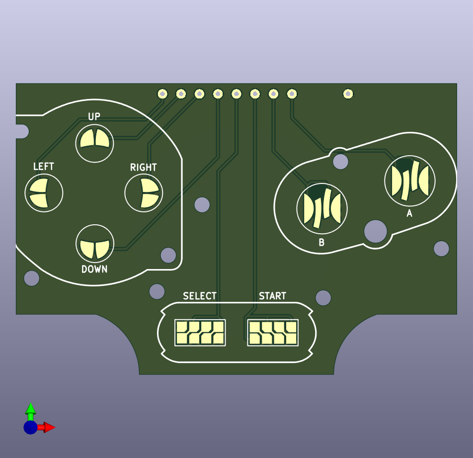
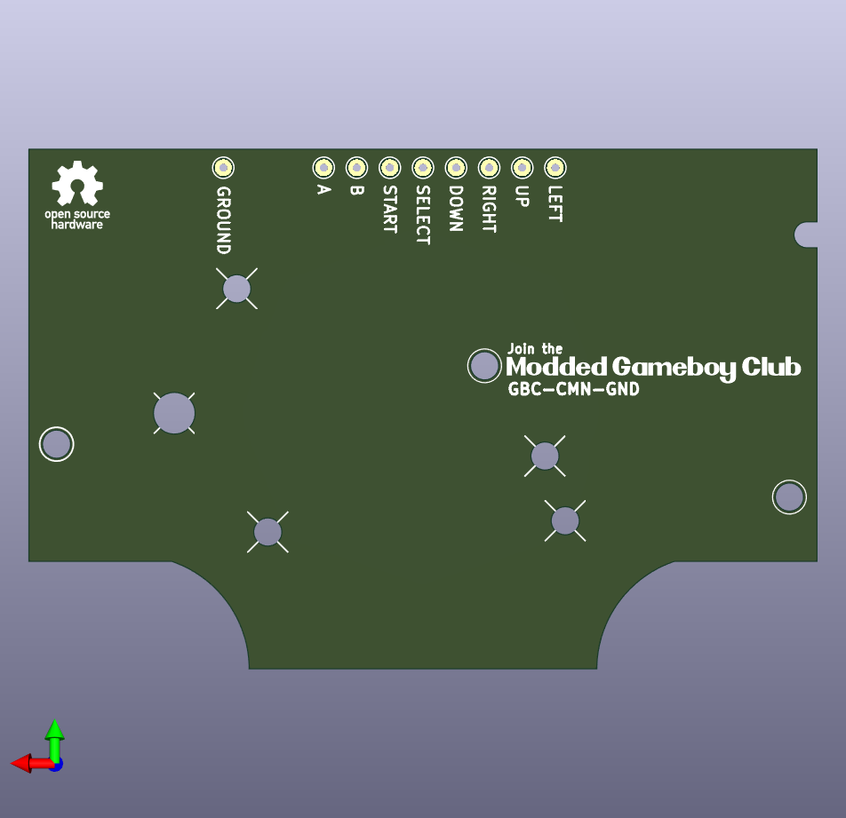

# GameBoy direction PCBs
Direction PCBs for the Game Boy line. These are common ground PCBs that can be used to create mods inside the various Game Boy Shells.

### Navigating this repo
Each folder includes the gerber files, and also all the KiCad files for the boards.

- *.pretty* folders contain the footprints that are used on the board.
- *.zip* files are the gerbers you send the the PCB manufacturer. Order at 1mm ENIG.

#### Game Boy Color

| Front | Back |
|-------------| -----|
|  |  |

## Follow me

If you are into Game Boy modding or retro gaming, please consider using code "NatalieTheNerd" at:

• [Retro Modding](http://RetroModding.com) 

• [Retro Game Repair Shop](http://RetroGameRepairShop.com) 

• [Extreme Rate](http://ExtremeRate.com)

**My socials**

• [Twitter](https://twitter.com/natalie_thenerd) 

• [Instagram](https://www.instagram.com/natalie.thenerd/) 

• [Modded Gameboy Club](https://moddedgameboy.club/) - a club dedicated to the modification of Game Boys, freely sharing resources

## License

Please do not remove my logo, website and name.

The CC BY-SA 4.0 (Creative Commons Attribution-ShareAlike 4.0 International) license allows you to:

1. **Share** - Copy and redistribute the material in any medium or format.
2. **Adapt** - Remix, transform, and build upon the material for any purpose, even commercially.

### Conditions:

- **Attribution** - You must give appropriate credit, provide a link to the license, and indicate if changes were made. You may do so in any reasonable manner, but not in any way that suggests the licensor endorses you or your use.
- **ShareAlike** - If you remix, transform, or build upon the material, you must distribute your contributions under the same license as the original.
